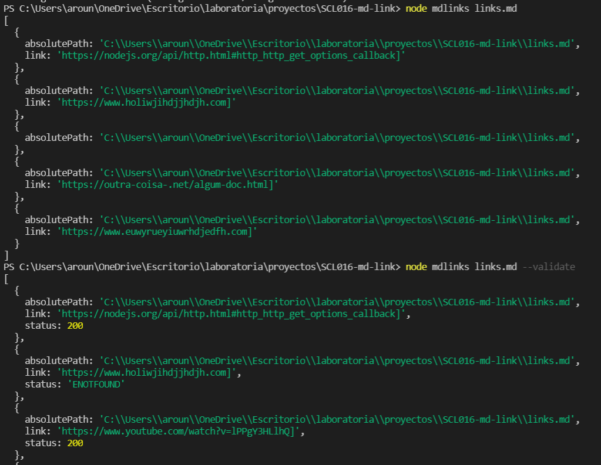

## *MD-LINKS*

### INTRODUCCIÓN

"*Md-links*" es un modulo que se desarrolló para extraer los links de un archivo con extensión .md, con el fin de validar y verificar si éstos funcionan, en el caso contrario, el módulo mostrará los links rotos junto con su error. 

### ¿CÓMO INSTALAR EL MÓDULO?
Abrir la terminal desde la carpeta del proyecto donde se quiere instalar el módulo, o en su defecto, abrir la carpeta del proyecto desde la terminal con los comandos necesarios (ejemplo: cd,ls, etc.)
Además, existen dos formas de instalarlo, de manera local y de manera general, las cuales se explicarán a continuación:

### local

npm install --save https://github.com/AliceInWonderDev/SCL007-md-links

### global

npm install --save https://github.com/AliceInWonderDev/SCL007-md-links -g

### ¿CÓMO USARLO COMO MÓDULO?
*md-links* retorna una promesa que corresponde a un arreglo de objetos, donde cada objeto contiene la información de cada link.

### Cada objeto del link contiene lo siguiente:

  - absolutePath: la ruta absoluta del archivo md ingresado.
  - link: el link extraido del archivo. 

### opción --validate

Si además de especificar el archivo .md, agregamos el comando *--validate* en la terminal, nos muestra un objeto que contiene:

  - absolutePath: la ruta absoluta del archivo md ingresado.
  - link: el link extraido del archivo. 
  - status: Muestra el número 200 si el link sirve, 404 si el link está roto y el mensaje 'ENOTFOUND' si el link no existe. 

### EJEMPLO DE USO EN TERMINAL

Escribir en la terminal:

node mdlinks archivo.md --validate.

Y mostrará algo así:

### SI RETORNA UN ERROR

*md-links* puede retornar un error en los siguientes casos:

* La ruta no es valida.
* La ruta ingresada no corresponde a un archivo .md
* El archivo ingresado no contiene links.